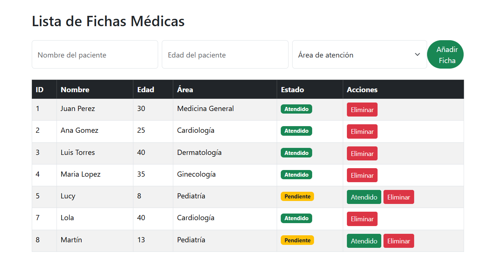

 # Fichas-Medicas-App
Aplicación web desarrollada como parte de un webinar formativo sobre Bootstrap y desarrollo con Python y Flask.

## Funcionalidades
- Añadir fichas médicas de pacientes
- Asignar áreas de atención
- Marcar estado: “Pendiente” o “Atendido”
- Eliminar registros

## Tecnologías utilizadas
- Python
- Flask
- Bootstrap
- HTML
- SQLite

## Demo online
👉 [fichas-medicas-app.onrender.com](https://fichas-medicas-app.onrender.com)

## Repositorio
🔗 [GitHub – Fichas-Medicas-App](https://github.com/PatriciaGHerreros/Fichas-Medicas-App)

